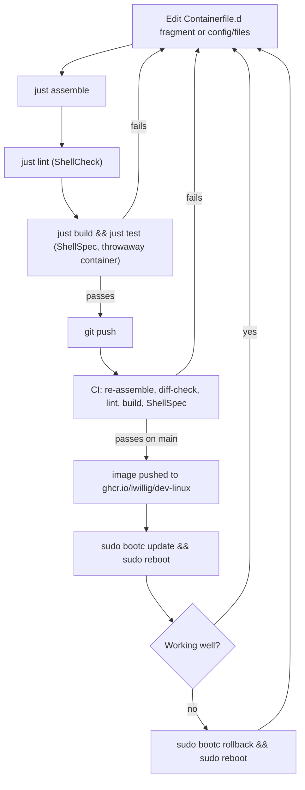

# dev-linux

A custom Fedora Atomic image based on [Bluefin
DX](https://projectbluefin.io/), optimized for development on a
Framework Intel laptop.

Bluefin DX is itself built on **Fedora Silverblue** — Fedora's atomic,
immutable desktop variant. The base OS lives on a read-only `ostree` commit;
`bootc` layers container images on top of it, and updates replace the whole
image atomically instead of patching packages in place. That gives this
project instant rollback (`bootc rollback`), an image that's identical on
every machine it's deployed to, and a build that's just a `Containerfile` —
no snowflake state to drift out of sync.

This repo also works as a template for the general workflow: define your
desired system as a `Containerfile` (or fragments, as below) layered on any
`bootc`-enabled Fedora Atomic base, build it with `podman`/`buildah`, test it
in a throwaway container or VM before trusting it, and ship it via
`bootc switch`/`bootc update`. The same pattern extends to CoreOS, other
`ublue-os` images, or a from-scratch atomic image of your own.

## What's included

- **Base**: `ghcr.io/ublue-os/bluefin-dx:stable` — GNOME + dev tooling baseline (Fedora 44)
- **Shell**: fish (default), with starship prompt
- **Terminal**: Alacritty, Zellij
- **Editors**: Emacs, Neovim
- **Dev tools**: gcc/make/gdb (Development Tools group), pandoc, aspell, fd, bat, eza, zoxide, fzf, jq, yq, httpie, zellij
- **Browsers**: Firefox, Nyxt
- **Apps**: 1Password
- **Fonts**: JetBrains Mono Nerd Font, Cascadia Code, Inter — with tuned subpixel rendering
- **Framework extras**: thermald, fprintd (fingerprint reader), powertop

---

## Design goal: safe, agent-driven iteration

The point of building on an atomic, immutable base isn't just rollback safety —
it's that the *entire system* is described as version-controlled config, which
means an AI coding agent (or you, moving fast) can propose a change, and that
change can be linted and tested before it ever touches a machine you actually
boot into. Nothing is installed by hand; if it's not in `Containerfile.d/` or
`config/files/`, it doesn't exist in the next build. That constraint is what
makes the loop below safe to run unattended: every change is a diff, every
diff is checked twice, and the worst case is `bootc rollback`.



Every change gets tested twice before it's live: once locally against a
throwaway container, once more in CI against the exact image that would ship.
The only step that isn't automatically checked is `bootc update` itself on
real hardware — and even that is one command away from undone.

---

## How this project works

The `Containerfile` is generated from small, purpose-scoped fragments that get
assembled, tested, and shipped by CI. The pieces:

### `Containerfile.d/*.containerfile` — the actual build recipe

Each fragment layers one concern on top of `ghcr.io/ublue-os/bluefin-dx:stable`,
numbered so they apply in a predictable order:

| Fragment | What it adds |
|---|---|
| `000-header` | Base image + tag args (`bluefin-dx:stable`) |
| `010-hardware` | Framework-specific packages: `thermald`, `fprintd` (fingerprint reader), `powertop` |
| `020-devtools` | Compiler toolchain (`development-tools` group), Emacs, Neovim, tmux, pandoc, LaTeX, fish, Alacritty, Firefox, CLI staples (ripgrep, fzf, bat, eza, jq, gh, ShellCheck, …), and dotfiles tooling (`stow`, `gitleaks`) |
| `030-cli-tools` | Tools not packaged for Fedora: zellij, lazygit, fastfetch, starship, the `whis` voice-to-text CLI, `trufflehog` secret scanner |
| `040-browsers` | Nyxt (Lisp-extensible browser), installed from its AppImage tarball |
| `050-package-managers` | Homebrew and SDKMAN!, installed into `/var` so they survive `bootc` updates and are writable by the `wheel` group without sudo |
| `060-languages` | Node/npm-based tooling (Claude Code CLI, TypeScript + LSP, the Pi coding agent), Clojure, and Rust (Fedora's `rustc`/`cargo`, not rustup) |
| `070-apps` | Handy and Whis desktop — push-to-talk speech-to-text GUIs |
| `080-gis` | Spatial/GIS stack: GDAL, Mapnik, QGIS, GRASS, PROJ, GEOS, SpatiaLite |
| `090-wine` | Wine + winetricks for running Windows binaries |
| `100-fonts` | JetBrains Mono, Cascadia Code, Noto Emoji, Inter, and the Nerd Font-patched JetBrains Mono |
| `110-config` | Copies `config/files/` into the image root and enables the first-boot 1Password install service |
| `120-sway` | Sway tiling WM stack (waybar, wofi, mako, kanshi, swaylock/idle/bg) alongside GNOME — GDM picks it up automatically as a login session |
| `121-elementary-theme` | Builds the elementary GTK stylesheet from source (not packaged for Fedora) |
| `125-llama-cpp` | Local LLM inference via prebuilt `llama.cpp` CPU binaries, pinned to a specific release tag |

Run `just assemble` to concatenate these into the real `Containerfile` (the
generated file carries a header telling you not to edit it directly). CI
re-runs `just assemble` and fails the build if the checked-in `Containerfile`
doesn't match — so the fragments are always the source of truth.

### `config/files/` — a filesystem overlay

Mirrors the target root filesystem (`etc/`, `usr/share/`) and gets `COPY`'d
wholesale into the image by `110-config.containerfile`. This is where
declarative config lives instead of `RUN sed`/`echo` hacks: fish integration
snippets for Homebrew/SDKMAN, fontconfig tuning, GTK settings, the kanshi
output-switching rules, the full waybar config (modules + CSS tokens), sway
keybindings, swaylock/gammastep config, and the desktop wallpaper.

### Dotfiles: system config vs. personal config

`config/files/` (above) only covers *system-wide* config — the stuff baked
into the public image at `/etc` and `/usr/share`. It deliberately never
holds anything personal or secret, because this repo's image is pushed
public to GHCR.

Personal, per-user config (editor settings, terminal themes, shell
aliases, API tokens) lives in a **separate, private** dotfiles repo,
managed with [GNU Stow](https://www.gnu.org/software/stow/) — installed
as a system package by `020-devtools.containerfile` so it's always
available, without this repo ever needing to see what's inside it.

The pattern:

- **Keep the dotfiles repo private on GitHub.** It's the only thing
  standing between your editor config and your API tokens, SSH config,
  and shell history conventions. Clone it over SSH
  (`git@github.com:<you>/dotfiles.git`), not HTTPS — SSH auth to a
  private repo doesn't depend on a PAT sitting in a credential helper.
- **Lay it out as Stow packages.** Each top-level directory mirrors
  `$HOME` from the point where it should be symlinked, e.g.
  `fish/.config/fish/config.fish` or `emacs/.emacs.d/init.el`. Running
  `stow fish` from the repo root symlinks `fish/.config/fish` into
  `~/.config/fish`; `stow -D fish` removes the symlinks. This keeps the
  repo itself as the single source of truth — `~/.config/fish/config.fish`
  is a symlink, not a copy, so edits in place are edits to the repo.
- **Never put secrets in the repo, even though it's private.** Private
  repos still end up in local clones, backups, and (if a repo is ever
  made public by mistake) full history. Reference secrets through
  [1Password's CLI](https://developer.1password.com/docs/cli/) instead:
  `set -x HF_TOKEN (op read "op://Personal/HF_TOKEN/credential")` in
  `fish/config.fish`, for example. The repo holds the *lookup*, never the
  *value*. 1Password (`070-apps.containerfile`) and its SSH agent
  integration are already part of this image for exactly this reason.
- **Gitignore anything that isn't config.** Editors and agent tools
  routinely drop caches, session logs, and backup files inside the same
  directories your dotfiles live in (`.bak` files, `sessions/`,
  `*-cache.json`, `npm/`). None of that belongs in version control —
  add it to the dotfiles repo's `.gitignore` before the first `git add`,
  not after something sensitive slips in.
- **Scan before you push.** `gitleaks` (added in `020-devtools.containerfile`,
  alongside `stow`) scans a repo's working tree *and* full history for
  credential-shaped strings. Run `gitleaks git .` from the dotfiles repo
  periodically, or wire it in as a pre-commit hook
  (`gitleaks protect --staged`), so an accidentally hardcoded token gets
  caught locally instead of after `git push`.

### `justfile` — the command surface

Task runner for every workflow in this repo: assembling and building the
image (`build`, `build-fresh`), poking at it (`shell`, `check-fonts`,
`check-packages`), linting the repo's shell scripts (`lint`), running the
test suite (`test`, `test-fast`), swapping your live Framework laptop onto a
locally-built image (`local-switch`), managing the QEMU test VM (`vm-*`),
writing installer ISOs to USB (`usb-list`, `usb-write`), and cutting releases
(`release`, `download-release`).

### `spec/` — ShellSpec test suite

Behavioral tests that run *inside* the built container image (via
`vendor/shellspec`, a vendored copy of the [ShellSpec](https://shellspec.info/)
BDD framework) to confirm the build actually produced a working system:
editors and CLI tools are on `PATH` and report sane `--version` output,
fonts are registered with fontconfig, Sway/waybar/swaylock are installed,
language runtimes are pinned to expected versions, llama.cpp's binaries and
bundled shared libraries are in place, and config files (default shell,
Homebrew/SDKMAN ownership) landed correctly.

### `.github/workflows/` — CI/CD

- **`build.yml`** — on every push/PR to `main` (and weekly on a cron, to catch
  upstream Bluefin drift): assembles the Containerfile, verifies it's in sync,
  lints the repo's shell scripts with ShellCheck (`just lint`), builds the
  image, runs the full ShellSpec suite against it, and (main branch only)
  pushes to `ghcr.io/iwillig/dev-linux`.
- **`build-disk-images.yml`** — on a `v*` tag push (or manual dispatch):
  rebuilds and pushes the OCI image, then runs `bootc-image-builder` twice to
  produce a bootable `qcow2` (for QEMU testing) and an Anaconda `iso` (for USB
  installs), compresses them, and attaches both to a GitHub Release.

### `vm/`

Working directory for QEMU test-VM artifacts (disk images, downloaded ISOs,
OVMF firmware vars) created by the `just vm-*` recipes — gitignored, not part
of the build itself.

---

## Installing on the Framework laptop

The recommended path uses a custom installer ISO built from your exact
OCI image via
[`bootc-image-builder`](https://github.com/osbuild/bootc-image-builder). You
boot from it and the Anaconda installer puts your image directly onto
disk — no internet required on the target machine after that.

### Step 1 — Make the GHCR image public

Go to **github.com/iwillig/dev-linux → Packages → dev-linux → Package settings → Change visibility → Public**.

This is required for `bootc-image-builder` and `bootc` to pull the image without credentials.

### Step 2 — Build and download the installer ISO

Tag a release to trigger the CI build:

```bash
just release v0.1.0
```

CI will build the OCI image, run `bootc-image-builder` to produce a custom Anaconda ISO, and attach it to the GitHub Release. Once the run finishes (~15 min), download it:

```bash
just download-release   # saves to vm/
```

Or download manually from the [Releases page](https://github.com/iwillig/dev-linux/releases).

### Step 3 — Write the ISO to USB

```bash
# Find your USB device
just usb-list

# Write the ISO (replace /dev/disk4 with your USB device)
sudo dd if=vm/dev-linux-v0.1.0.iso of=/dev/disk4 bs=4m status=progress
```

> On macOS use `just usb-write /dev/disk4` — it handles unmounting and uses the raw device automatically.

### Step 4 — Install

1. Plug USB into Framework, power on, press F12 for boot menu
2. Select the USB drive
3. Follow the Anaconda installer — partition as you like, set username/password
4. Reboot — you're running your custom image

### Step 5 — Updating after installation

Whenever you add or change packages, push to `main`, wait for CI to finish, then on the Framework:

```bash
sudo bootc update
sudo reboot
```

`bootc update` pulls only the changed layers from GHCR (fast after the
first pull), stages the new image alongside the running one, and
activates it on next boot. Your data in `/home` is untouched.

To check whether an update is available without applying it:

```bash
sudo bootc status
```

To roll back to the previous image if something goes wrong:

```bash
sudo bootc rollback
sudo reboot
```

---

## Alternative: bootc switch from stock Silverblue

If you already have Fedora Silverblue installed, you can rebase to
this image directly without a custom ISO:

```bash
sudo bootc switch ghcr.io/iwillig/dev-linux:latest
sudo reboot
```

After the initial switch, future updates work the same way:

```bash
sudo bootc update
sudo reboot
```

---

## Local development

Requires `podman` and `just`. Works on both Linux (native) and macOS.

```bash
just build          # build amd64 image locally via podman
just shell          # open bash inside the built image
just test           # smoke-test: verify key commands and fonts
just check-fonts    # list installed fonts
just check-packages # list installed packages
```

### Testing on Linux (live system)

Since you're already running dev-linux, the fastest feedback loop is to build
locally and switch the running system to your changes:

```bash
just local-switch   # build → export → sudo bootc switch (staged, not yet active)
sudo reboot         # activate the new image
```

If something breaks after rebooting:

```bash
sudo bootc rollback
sudo reboot
```

`bootc` keeps the previous image around, so rollback is instant.

### Testing on macOS

Requires `podman` (`brew install podman`) and `just`.

---

## QEMU testing

Test the image in an isolated VM before installing on bare metal. Downloads a
stock Fedora Silverblue ISO, installs it into a QEMU disk, then you rebase to
your custom image. On Linux the VM uses KVM hardware acceleration; on macOS it
falls back to TCG software emulation.

```bash
just vm-download-iso   # one-time: download Fedora 44 Silverblue ISO (~2.5 GB)
just vm-create         # one-time: create 60 GB disk (+ init OVMF_VARS on Linux)
just vm-install        # one-time: boot installer, follow Anaconda
just vm-run            # start the VM
just vm-ssh            # SSH into the running VM

# Inside the VM, switch to your image:
sudo bootc switch ghcr.io/iwillig/dev-linux:latest
sudo reboot
```

To test a locally-built image without pushing to GHCR:

```bash
just vm-snapshot          # save a rollback point
just vm-load-local        # push local image into VM via SSH
# Inside VM:
sudo bootc switch --transport containers-storage localhost/dev-linux:local
sudo reboot
```

### Alternatively: use the CI-built qcow2

Skip the Silverblue install step entirely by downloading the pre-built
qcow2 from a release:

```bash
just download-release   # downloads and decompresses the qcow2 into vm/
just vm-run             # boot straight into your image
```

---

## Releasing

```bash
just release v0.2.0
```

This tags the commit and pushes the tag. GitHub Actions then:
1. Builds the OCI image and pushes it to `ghcr.io/iwillig/dev-linux:latest`
2. Runs `bootc-image-builder` to produce `dev-linux-v0.2.0.iso` and `dev-linux-v0.2.0.qcow2.zst`
3. Attaches both to a GitHub Release

You can also trigger the disk image build manually from the Actions tab (useful for testing the ISO without tagging).

---

## Displays

The laptop panel (`eDP-1`) auto-disables whenever the ViewSonic XG3220
external monitor is connected, so the external monitor is the only active
display rather than extending/mirroring — handled by `kanshi`
(`/etc/kanshi/config`), matched by monitor make/model/serial rather than
connector name so it keeps working regardless of which port/dock it's
plugged into.

- **sway**: automatic via kanshi. Manual override: `mod+shift+i` (laptop
  only) / `mod+shift+o` (external only), or `kanshictl switch laptop|external`
  from a terminal.
- **GNOME**: kanshi requires the wlr-output-management protocol, which
  mutter doesn't implement, so switching there is manual — use Settings →
  Displays, or `gnome-monitor-config list` / `set` from a terminal.

To support a different external monitor, update the `output "..."` match
string in `/etc/kanshi/config` — get the exact make/model/serial via
`swaymsg -t get_outputs`.

---

## Known issues

### Zoom screen sharing fails on sway ("No supported targets specified")

Sharing a screen or window in Zoom silently fails to start. The portal logs
the error:

```
journalctl --user -u xdg-desktop-portal-wlr
[ERROR] - wlroots: No supported targets specified
```

This is an upstream bug in `xdg-desktop-portal-wlr` 0.8.1/0.8.2 (the version
shipped in Fedora 44):
[emersion/xdg-desktop-portal-wlr#379](https://github.com/emersion/xdg-desktop-portal-wlr/issues/379).
`SelectSources` defaults its requested type-mask to `0` instead of `MONITOR`
when the caller omits the `types` option, so the type intersection is always
empty and the call fails — regardless of whether you pick a monitor or a
window in the share dialog. It is not specific to Zoom; any client that omits
`types` (per the portal spec, which allows this) hits it.

As of 2026-06-20, the latest upstream release (0.8.3) does not include a fix.
A one-line patch is posted on the issue and has been community-confirmed to
work, but isn't merged yet. Revisit once upstream merges a fix or Fedora
picks up a patched build — until then, no workaround is applied in this
image.
